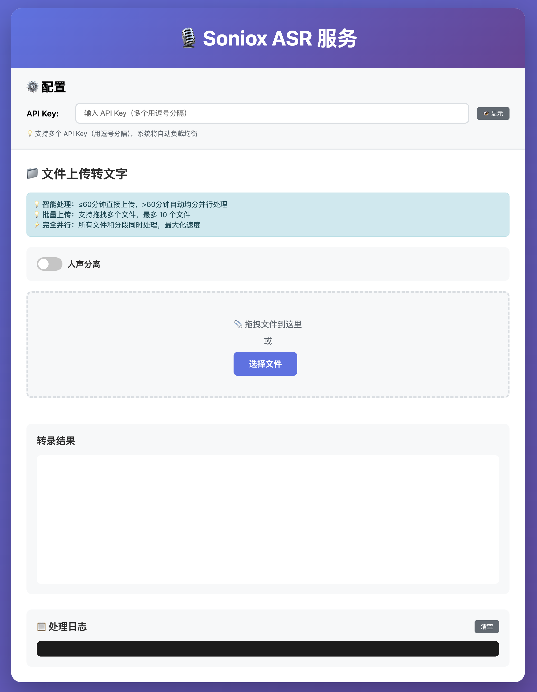

# Soniox ASR Web UI 服务

<div align="center">


基于 Soniox API 的完整语音识别 Web 界面，支持文件上传转文字和 RESTful API 服务。

[功能特性](#-核心特性) • [快速开始](#-快速开始) • [使用说明](#-使用说明) • [API 文档](#-使用-api-服务) • [故障排除](#-故障排除)

</div>

---

## 📸 界面预览



**主要功能**：
- 拖拽上传、实时进度、批量处理
- API 测试：可视化测试、代码示例、响应预览
- 详细日志：彩色日志、时长统计、错误追踪

## ✨ 核心特性

### 📁 文件上传转文字
- ✅ **多格式支持**：mp3, wav, m4a, flac, ogg 等 60+ 种音频格式
- ✅ **智能切分**：自动处理超过 60 分钟的长音频文件
- ✅ **批量上传**：最多 10 个文件同时上传，支持拖拽
- ✅ **完全并行**：所有文件和分段同时处理，最大化速度
- ✅ **人声分离**：自动识别不同说话人（最多 15 人）
- ✅ **实时进度**：进度条、百分比、并行任务数实时显示
- ✅ **时长统计**：总耗时、转录耗时、每个任务耗时详细记录
- ✅ **智能重试**：API Key 失效自动切换，最多重试 3 次
- ✅ **负载均衡**：多个 API Key 随机分配，避免单点限流
- ✅ **持久化存储**：API Key 自动保存，刷新页面自动恢复
- ✅ **结果下载**：单个或批量下载 TXT 格式转录结果

### 🔌 RESTful API 服务
- ✅ **独立后端**：FastAPI 高性能异步服务
- ✅ **自动切分**：后端自动处理超过 60 分钟的音频
- ✅ **重试机制**：API Key 失效自动重试
- ✅ **时长统计**：详细的处理时长分析
- ✅ **Swagger 文档**：交互式 API 文档
- ✅ **CORS 支持**：跨域请求支持

## 🚀 快速开始

### 前置要求

- Python 3.7+
- FFmpeg（音频处理）
- Soniox API Key（[获取地址](https://console.soniox.com)）

### 方式一：一键启动（推荐）

```bash
# 克隆项目
git clone <your-repo-url>
cd soniox-server

# 一键启动
chmod +x start.sh
./start.sh
```

启动后自动打开：
- 前端服务：http://localhost:8000
- 后端 API：http://localhost:8001

### 方式二：手动启动

#### 1. 安装依赖

```bash
# 安装 Python 依赖
pip3 install -r requirements.txt

# 安装 FFmpeg
# macOS
brew install ffmpeg

# Ubuntu/Debian
sudo apt-get install ffmpeg

# Windows
# 从 https://ffmpeg.org/download.html 下载
```

#### 2. 启动服务

```bash
# 启动后端 API（可选）
python3 server.py

# 启动前端（新终端）
python3 -m http.server 8000
```

## 📱 访问界面

| 服务 | 地址 | 说明 |
|------|------|------|
| 主界面 | http://localhost:8000 | 文件上传转文字 |
| WebSocket 测试 | http://localhost:8000/websocket-test.html | 实时语音转录测试 |
| API 测试 | http://localhost:8000/api-test.html | 可视化 API 测试 |
| API 文档 | http://localhost:8001/docs | Swagger 交互式文档 |
| 清除存储 | http://localhost:8000/clear-storage.html | 清除保存的 API Key |

## 🔧 使用说明

### 1. 配置 API Key

#### 获取 API Key
1. 访问 [Soniox Console](https://console.soniox.com)
2. 注册/登录账号
3. 创建新的 API Key
4. 复制 Key 到剪贴板

#### 配置 Key
```
单个 Key：
YOUR_API_KEY

多个 Key（负载均衡）：
KEY1,KEY2,KEY3
```

**特性**：
- ✅ 自动保存到浏览器 localStorage
- ✅ 刷新页面自动恢复
- ✅ 多个 Key 自动负载均衡
- ✅ Key 失效自动切换重试

### 2. 文件上传转录

#### 基础使用
1. 打开主界面 http://localhost:8000
2. 输入 API Key（首次使用）
3. 选择是否启用人声分离
4. 拖拽文件或点击选择（最多 10 个）
5. 点击"开始转录"
6. 查看实时进度和日志
7. 下载转录结果

#### 智能处理逻辑
```
文件时长 ≤ 300 分钟（5 小时）
  → 直接上传处理

文件时长 > 300 分钟
  → 自动均分切片
  → 并行处理所有片段
  → 合并转录结果
```

#### 批量处理
- 支持同时上传 10 个文件
- 所有文件完全并行处理
- 实时显示每个文件状态
- 单独下载或批量下载结果

### 3. 使用 API 服务

#### 文件转录 API

**端点信息**

```
POST http://localhost:8001/transcribe
```

**请求参数**

| 参数 | 类型 | 必填 | 说明 |
|------|------|------|------|
| file | File | ✅ | 音频文件 |
| api_keys | String | ✅ | 逗号分隔的 API Keys |
| enable_diarization | Boolean | ❌ | 是否启用人声分离（默认 false）|

#### cURL 示例

```bash
curl -X POST "http://localhost:8001/transcribe" \
  -F "file=@audio.mp3" \
  -F "api_keys=YOUR_KEY1,YOUR_KEY2" \
  -F "enable_diarization=false"
```

#### Python 示例

```python
import requests

url = "http://localhost:8001/transcribe"

# 准备文件和参数
files = {'file': open('audio.mp3', 'rb')}
data = {
    'api_keys': 'YOUR_KEY1,YOUR_KEY2',
    'enable_diarization': 'false'
}

# 发送请求
response = requests.post(url, files=files, data=data)
result = response.json()

# 处理结果
if result['success']:
    print(f"转录文本: {result['text']}")
    print(f"音频时长: {result['audio_duration']}秒")
    print(f"处理时长: {result['processing_time']['total']}秒")
    print(f"切片数量: {result['total_chunks']}")
else:
    print(f"错误: {result.get('detail', '未知错误')}")
```

#### JavaScript 示例

```javascript
const formData = new FormData();
formData.append('file', fileInput.files[0]);
formData.append('api_keys', 'YOUR_KEY1,YOUR_KEY2');
formData.append('enable_diarization', 'false');

fetch('http://localhost:8001/transcribe', {
    method: 'POST',
    body: formData
})
.then(response => response.json())
.then(result => {
    console.log('转录文本:', result.text);
    console.log('处理时长:', result.processing_time.total);
})
.catch(error => console.error('错误:', error));
```

#### 响应格式

```json
{
  "success": true,
  "text": "转录的完整文本内容...",
  "words": [
    {
      "text": "你好",
      "start_time": 0.5,
      "end_time": 0.8
    }
  ],
  "audio_duration": 3600.5,
  "total_chunks": 2,
  "processing_time": {
    "total": 45.23,
    "chunks": [
      {"chunk": 1, "duration": 22.5},
      {"chunk": 2, "duration": 21.8}
    ]
  }
}
```

### 5. 使用 WebSocket 实时转录

#### WebSocket 端点

```
ws://localhost:8001/ws/transcribe
```

#### 连接流程

1. **建立 WebSocket 连接**
2. **发送配置消息**（JSON 格式）
3. **发送音频数据**（二进制格式）
4. **接收实时转录结果**（JSON 格式）
5. **发送空帧结束**

#### 配置参数

```json
{
  "api_key": "YOUR_API_KEY",
  "model": "stt-rt-preview",
  "audio_format": "auto",
  "enable_speaker_diarization": false,
  "enable_endpoint_detection": false,
  "enable_language_identification": true,
  "language_hints": ["en", "zh"],
  "translation": {
    "type": "one_way",
    "target_language": "zh"
  }
}
```

#### Python 示例

```python
import asyncio
import websockets
import json

async def transcribe_realtime():
    uri = "ws://localhost:8001/ws/transcribe"
    
    async with websockets.connect(uri) as websocket:
        # 1. 发送配置
        config = {
            "api_key": "YOUR_API_KEY",
            "model": "stt-rt-preview",
            "audio_format": "pcm_s16le",
            "sample_rate": 16000,
            "num_channels": 1,
            "enable_speaker_diarization": True
        }
        await websocket.send(json.dumps(config))
        
        # 2. 发送音频数据（示例）
        with open("audio.raw", "rb") as f:
            while chunk := f.read(4096):
                await websocket.send(chunk)
        
        # 3. 发送空帧表示结束
        await websocket.send(b"")
        
        # 4. 接收转录结果
        async for message in websocket:
            result = json.loads(message)
            
            if result.get("error"):
                print(f"错误: {result['error']}")
                break
            
            # 处理 tokens
            for token in result.get("tokens", []):
                if token["is_final"]:
                    print(token["text"], end="", flush=True)
            
            # 检查是否结束
            if result.get("finished"):
                print("\n转录完成")
                break

asyncio.run(transcribe_realtime())
```

#### JavaScript 示例

```javascript
const ws = new WebSocket('ws://localhost:8001/ws/transcribe');

ws.onopen = async () => {
    // 1. 发送配置
    const config = {
        api_key: 'YOUR_API_KEY',
        model: 'stt-rt-preview',
        audio_format: 'auto',
        enable_speaker_diarization: true
    };
    ws.send(JSON.stringify(config));
    
    // 2. 获取麦克风并发送音频
    const stream = await navigator.mediaDevices.getUserMedia({ audio: true });
    const mediaRecorder = new MediaRecorder(stream);
    
    mediaRecorder.ondataavailable = (event) => {
        if (event.data.size > 0) {
            event.data.arrayBuffer().then(buffer => {
                ws.send(buffer);
            });
        }
    };
    
    mediaRecorder.start(100); // 每 100ms 发送一次
};

ws.onmessage = (event) => {
    const result = JSON.parse(event.data);
    
    // 3. 处理转录结果
    if (result.tokens) {
        result.tokens.forEach(token => {
            if (token.is_final) {
                console.log(token.text);
            }
        });
    }
    
    if (result.finished) {
        console.log('转录完成');
        ws.close();
    }
};
```

#### 响应格式

```json
{
  "tokens": [
    {
      "text": "Hello",
      "start_ms": 600,
      "end_ms": 760,
      "confidence": 0.97,
      "is_final": true,
      "speaker": "1",
      "language": "en"
    }
  ],
  "final_audio_proc_ms": 760,
  "total_audio_proc_ms": 880
}
```

#### 特殊 Token

- **`<end>` token**：启用端点检测时，表示说话结束
- **`is_final: false`**：临时结果，可能会改变
- **`is_final: true`**：最终结果，不会再改变

#### 实时翻译

**单向翻译**（所有语言翻译成目标语言）：

```json
{
  "translation": {
    "type": "one_way",
    "target_language": "zh"
  }
}
```

**双向翻译**（两种语言互译）：

```json
{
  "translation": {
    "type": "two_way",
    "language_a": "en",
    "language_b": "zh"
  }
}
```

## 📊 功能详解

### 时长统计

实时显示处理进度和时长：

```
总耗时: 45.23秒 | 转录总时长: 42.50秒 | 并行任务数: 4
```

- **总耗时**：从开始到结束的总时间（包括切分、上传、等待）
- **转录耗时**：实际调用 API 的时间总和
- **每个任务耗时**：每个文件/分段的详细处理时间
- **并行任务数**：同时处理的任务数量

### API Key 重试机制

智能重试流程：

```
1. 使用 Key1 → 失败（401 Unauthorized）
2. 自动切换到 Key2 → 失败（429 Rate Limit）
3. 自动切换到 Key3 → 成功 ✅
```

日志示例：
```
🔍 尝试使用 API Key: 637ea482fe... (尝试 1/3)
⚠️  API Key 失败，尝试下一个... (401 Unauthorized)
🔍 尝试使用 API Key: 8f9a3b2c1d... (尝试 2/3)
✅  转录成功
```

### API Key 持久化

- 输入后自动保存到 `localStorage`
- 刷新页面自动恢复
- 主界面和 API 测试页面共享存储
- 可通过清理页面手动清除

### 人声分离

启用后自动识别不同说话人：

```
说话人 1: 大家好，欢迎来到今天的会议。
说话人 2: 谢谢主持人，我先介绍一下项目进展。
说话人 1: 好的，请讲。
```

- 最多支持 15 个说话人
- 自动标记说话人编号
- 适用于会议、访谈、多人对话

## 🛠️ 技术架构

### 前端技术栈

```
HTML5 + CSS3 + Vanilla JavaScript
├── Web Audio API      # 音频时长检测
├── Fetch API          # 文件上传
├── localStorage       # API Key 持久化
└── Promise.all()      # 完全并行处理
```

### 后端技术栈

```
FastAPI + Uvicorn
├── Pydub              # 音频处理和切分
├── HTTPX              # 异步 HTTP 客户端
├── asyncio            # 异步并发处理
└── python-multipart   # 文件上传处理
```

### API 集成

| API | 用途 | 文档 |
|-----|------|------|
| POST /v1/files | 上传音频文件 | [链接](https://soniox.com/docs) |
| POST /v1/transcriptions | 创建转录任务 | [链接](https://soniox.com/docs) |
| GET /v1/transcriptions/{id} | 查询转录状态 | [链接](https://soniox.com/docs) |
| GET /v1/transcriptions/{id}/transcript | 获取转录文本 | [链接](https://soniox.com/docs) |

## 📝 支持的音频格式

### 常见格式
✅ mp3, wav, m4a, flac, ogg, aac, webm, mp4

### 完整列表
aac, aiff, amr, asf, flac, mp3, ogg, wav, webm, m4a, mp4, wma, opus

### 格式说明
- **自动检测**：系统自动识别音频格式
- **无需转换**：直接上传原始文件
- **最佳格式**：推荐使用 wav 或 flac（无损）

## ⚠️ 限制说明

| 限制项 | 值 | 说明 |
|--------|-----|------|
| 单文件时长 | 300 分钟 | Soniox API 限制，系统自动切分 |
| 文件大小 | 无限制 | 根据时长自动处理 |
| 批量上传 | 10 个文件 | 前端限制，可修改 |
| 并行请求 | 无限制 | 注意 API 配额和限流 |

## 🔒 安全建议

### 开发环境
- ✅ 使用 localhost 测试
- ✅ API Key 保存在 localStorage
- ✅ 不要提交 API Key 到代码仓库

### 生产环境
- ⚠️ 使用 HTTPS
- ⚠️ 通过后端代理 API 请求
- ⚠️ 使用环境变量管理 API Key
- ⚠️ 定期轮换 API Key
- ⚠️ 设置 API 请求频率限制

### 最佳实践
```bash
# 使用环境变量
export SONIOX_API_KEY="your_key_here"

# 或使用 .env 文件（不要提交到 Git）
echo "SONIOX_API_KEY=your_key_here" > .env
```

## 📦 依赖项

### Python 依赖
```txt
fastapi==0.104.1        # Web 框架
uvicorn==0.24.0         # ASGI 服务器
httpx==0.25.1           # 异步 HTTP 客户端
pydub==0.25.1           # 音频处理
python-multipart==0.0.6 # 文件上传
```

### 系统依赖
- **Python**: 3.7 或更高版本
- **FFmpeg**: 音频格式转换和处理

## 🐛 故障排除

### 转录失败

**问题**：转录请求失败
```
❌ 转录失败: 所有 API Key 都已失效
```

**解决方案**：
1. 验证 API Key 是否正确
2. 检查 API Key 是否过期
3. 确认 Soniox 账户余额充足
4. 查看浏览器控制台错误信息
5. 检查网络连接

### API 服务无法启动

**问题**：端口被占用
```
ERROR: [Errno 48] Address already in use
```

**解决方案**：
```bash
# 查找占用端口的进程
lsof -i :8001

# 杀死进程
kill -9 <PID>

# 或使用其他端口
uvicorn server:app --port 8002
```

### 文件上传失败

**问题**：文件格式不支持

**解决方案**：
1. 确认文件格式在支持列表中
2. 检查文件是否损坏
3. 尝试转换为 wav 格式
4. 检查文件大小（< 500MB）

### API Key 未保存

**问题**：刷新后 API Key 消失

**解决方案**：
1. 检查浏览器是否禁用 localStorage
2. 清除浏览器缓存后重试
3. 使用非隐私模式
4. 手动访问清理页面重新输入

### FFmpeg 错误

**问题**：音频处理失败
```
FileNotFoundError: [Errno 2] No such file or directory: 'ffmpeg'
```

**解决方案**：
```bash
# 安装 FFmpeg
brew install ffmpeg  # macOS
sudo apt-get install ffmpeg  # Ubuntu
```

## 📈 性能优化

### 1. 使用多个 API Key
```
单个 Key：最大并发受限
多个 Key：负载均衡，提高吞吐量
```

### 2. 调整并行数
```javascript
// 根据网络和 API 配额调整
const MAX_CONCURRENT = 10;  // 默认值
```

### 3. 音频预处理
```bash
# 压缩音频减小文件大小
ffmpeg -i input.wav -ar 16000 -ac 1 output.wav
```

### 4. 本地缓存
- 避免重复上传相同文件
- 缓存转录结果
- 使用 CDN 加速静态资源

## 🔄 更新日志

### v2.1.0 (2025-01-11)
- ✨ 新增 API Key 持久化存储功能
- ✨ 新增清理存储页面
- 🔒 清除所有默认 API Key
- 📝 完善文档和使用说明
- 🐛 修复 API 测试页面问题

### v2.0.0 (2025-01-11)
- ✨ 新增 RESTful API 服务
- ✨ 新增 API Key 失效自动重试机制
- ✨ 新增详细时长统计功能
- ✨ 新增 API 测试界面
- ✨ 新增 Swagger 文档支持
- 🐛 修复多个并发处理问题
- 📝 完善文档和示例

### v1.0.0 (2025-01-10)
- ✨ 基础文件上传转文字功能
- ✨ 多文件批量处理
- ✨ 智能音频切分
- ✨ 完全并行处理
- ✨ 结果下载功能

## 📄 许可证

MIT License - 详见 [LICENSE](LICENSE) 文件

## 🔗 相关链接

- [Soniox 官网](https://soniox.com)
- [Soniox API 文档](https://soniox.com/docs)
- [Soniox Console](https://console.soniox.com)
- [FastAPI 文档](https://fastapi.tiangolo.com)
- [Pydub 文档](https://github.com/jiaaro/pydub)

## 🤝 贡献

欢迎贡献代码、报告问题或提出建议！

### 贡献方式
1. Fork 本项目
2. 创建特性分支 (`git checkout -b feature/AmazingFeature`)
3. 提交更改 (`git commit -m 'Add some AmazingFeature'`)
4. 推送到分支 (`git push origin feature/AmazingFeature`)
5. 开启 Pull Request

### 报告问题
- 使用 GitHub Issues
- 提供详细的错误信息和复现步骤
- 附上系统环境信息

## 📧 联系方式

如有问题或建议，请通过以下方式联系：
- GitHub Issues: [提交问题](../../issues)
- Email: neosun808@gmail.com

## 🙏 致谢

感谢以下开源项目：
- [FastAPI](https://fastapi.tiangolo.com) - 现代化的 Python Web 框架
- [Pydub](https://github.com/jiaaro/pydub) - 简单易用的音频处理库
- [Soniox](https://soniox.com) - 高质量的语音识别 API

---

<div align="center">

**⭐ 如果这个项目对你有帮助，请给个 Star！⭐**

Made with ❤️ by Neo Sun

</div>
