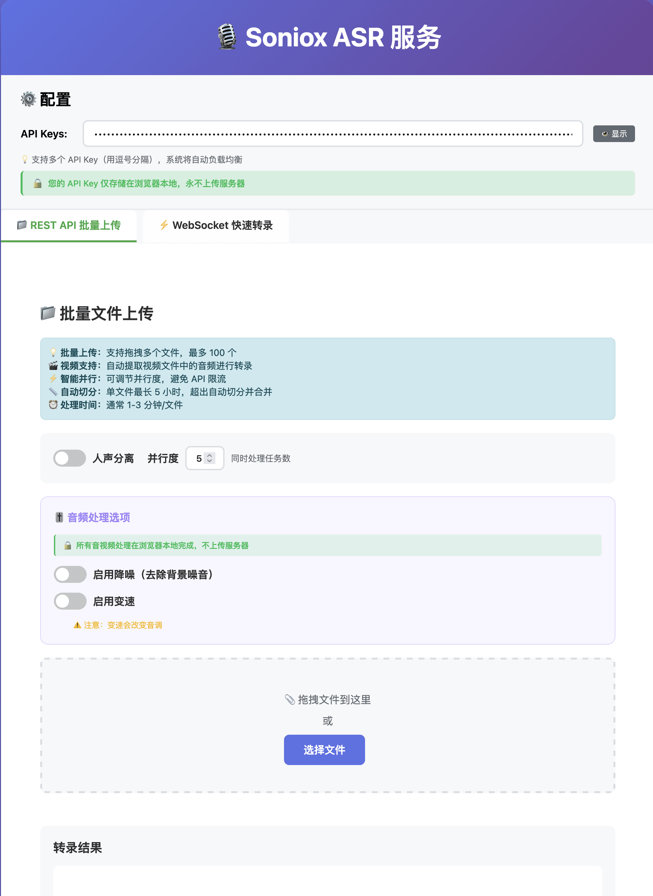

# Soniox ASR Web UI

<div align="center">

[](https://github.com/neosun100/soniox-asr-web/stargazers)
[](https://github.com/neosun100/soniox-asr-web/network/members)
[](https://github.com/neosun100/soniox-asr-web/issues)
[](https://github.com/neosun100/soniox-asr-web/blob/main/LICENSE)
[](https://www.python.org/)
[](https://fastapi.tiangolo.com/)

[简体中文](README.zh-CN.md) | [繁體中文](README.zh-TW.md) | [English](README.md) | [日本語](README.ja.md)

</div>

---

基于 Soniox API 的完整语音识别 Web 应用，支持文件转录、实时语音识别和多语言翻译。

## 📸 界面预览

### REST API 批量上传

<div align="center">



*文件转录界面，包含音频处理选项：降噪、变速和批量上传支持*

</div>

### WebSocket 实时转录

<div align="center">


*实时语音识别，支持多语言翻译和人声分离*

</div>

**三大核心功能**：
- **文件转录**：批量上传音频文件，自动切分长音频，并行处理
- **实时语音**：WebSocket 实时转录，支持麦克风录音和人声分离
- **多语言翻译**：60+ 语言支持，单向/双向实时翻译

---

## ✨ 功能特性

### 📁 文件转录（REST API）

- ✅ **多格式支持**：mp3, wav, m4a, flac, ogg 等 60+ 音频格式
- ✅ **视频支持**：自动提取视频文件音频（mp4, webm, mov, avi 等）
- ✅ **音频处理**：降噪和变速（1.25x-2.0x）选项
- ✅ **智能切分**：自动处理超过 5 小时的长音频文件
- ✅ **批量处理**：最多 100 个文件同时上传，可配置并发数
- ✅ **人声分离**：自动识别不同说话人（最多 15 人）
- ✅ **实时进度**：进度条、百分比、处理时长实时显示
- ✅ **智能重试**：API Key 失效自动切换，最多重试 3 次
- ✅ **结果下载**：单个或批量下载 TXT 格式转录结果
- ✅ **隐私优先**：所有音视频处理在浏览器完成，不上传服务器

### 🎤 实时语音识别（WebSocket）

- ✅ **麦克风录音**：浏览器直接录音，实时转录
- ✅ **流式处理**：边说边转，低延迟响应
- ✅ **人声分离**：实时识别不同说话人
- ✅ **语言识别**：自动检测语言并标注
- ✅ **端点检测**：自动识别说话结束（`<end>` token）
- ✅ **彩色显示**：不同语言用不同颜色标注

### 🌍 多语言翻译

- ✅ **60+ 语言**：支持中文、英语、日语、韩语、法语、德语等
- ✅ **单向翻译**：所有语言翻译成目标语言
- ✅ **双向翻译**：两种语言互译（如中英互译）
- ✅ **实时翻译**：边说边译，无需等待
- ✅ **颜色标注**：原文和译文用不同颜色区分

---

## 🚀 快速开始

```bash
# 克隆项目
git clone https://github.com/neosun100/soniox-asr-web.git
cd soniox-asr-web

# 安装依赖
pip3 install -r requirements.txt

# 安装 FFmpeg
brew install ffmpeg  # macOS
sudo apt-get install ffmpeg  # Ubuntu

# 一键启动
chmod +x start.sh
./start.sh
```

访问：http://localhost:8000

完整文档请查看 [English README](README.md)

---

<div align="center">

## 🌟 给我们一个 Star！🌟

**如果这个项目对你有帮助，请在 GitHub 上给它一个 ⭐ Star！**

你的支持是我们持续改进的最大动力！🚀

[](https://github.com/neosun100/soniox-asr-web/stargazers)

[⭐ Star 本仓库](https://github.com/neosun100/soniox-asr-web) | [🐛 报告 Bug](https://github.com/neosun100/soniox-asr-web/issues) | [✨ 请求新功能](https://github.com/neosun100/soniox-asr-web/issues)

---

Made with ❤️ by [Neo Sun](https://github.com/neosun100)

</div>
