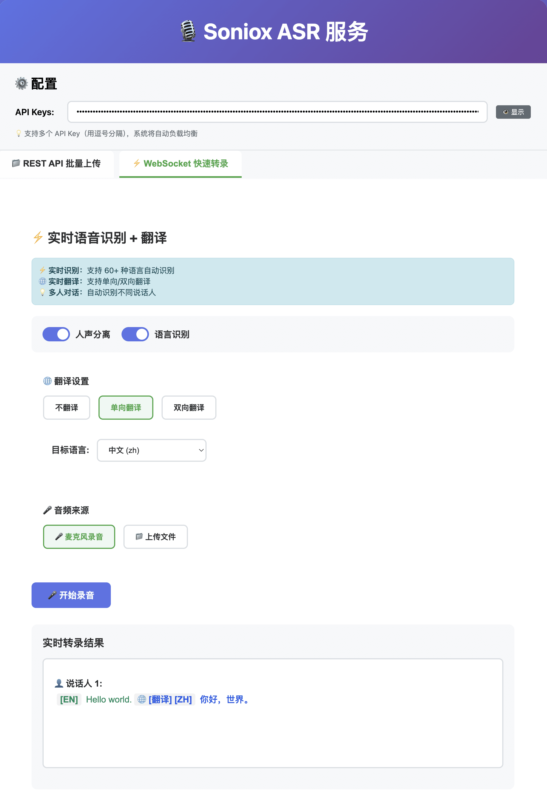

# Soniox ASR Web UI

<div align="center">

[](https://github.com/neosun100/soniox-asr-web/stargazers)
[](https://github.com/neosun100/soniox-asr-web/network/members)
[](https://github.com/neosun100/soniox-asr-web/issues)
[](https://github.com/neosun100/soniox-asr-web/blob/main/LICENSE)
[](https://www.python.org/)
[](https://fastapi.tiangolo.com/)

[简体中文](README.zh-CN.md) | [繁體中文](README.zh-TW.md) | [English](README.md) | [日本語](README.ja.md)

</div>

---

基於 Soniox API 的完整語音識別 Web 應用，支援檔案轉錄、即時語音識別和多語言翻譯。

## 📸 介面預覽

<div align="center">



*現代化 Web 介面，包含三大核心功能：檔案轉錄、即時語音和多語言翻譯*

</div>

**三大核心功能**：
- **檔案轉錄**：批次上傳音訊檔案，自動切分長音訊，並行處理
- **即時語音**：WebSocket 即時轉錄，支援麥克風錄音和人聲分離
- **多語言翻譯**：60+ 語言支援，單向/雙向即時翻譯

---

## ✨ 功能特性

### 📁 檔案轉錄（REST API）

- ✅ **多格式支援**：mp3, wav, m4a, flac, ogg 等 60+ 音訊格式
- ✅ **視訊支援**：自動提取視訊檔案音訊（mp4, webm, mov, avi 等）
- ✅ **音訊處理**：降噪和變速（1.25x-2.0x）選項
- ✅ **智慧切分**：自動處理超過 5 小時的長音訊檔案
- ✅ **批次處理**：最多 100 個檔案同時上傳，可設定並行數
- ✅ **人聲分離**：自動識別不同說話人（最多 15 人）
- ✅ **即時進度**：進度條、百分比、處理時長即時顯示
- ✅ **智慧重試**：API Key 失效自動切換，最多重試 3 次
- ✅ **結果下載**：單個或批次下載 TXT 格式轉錄結果
- ✅ **隱私優先**：所有音視訊處理在瀏覽器完成，不上傳伺服器

### 🎤 即時語音識別（WebSocket）

- ✅ **麥克風錄音**：瀏覽器直接錄音，即時轉錄
- ✅ **串流處理**：邊說邊轉，低延遲回應
- ✅ **人聲分離**：即時識別不同說話人
- ✅ **語言識別**：自動偵測語言並標註
- ✅ **端點偵測**：自動識別說話結束（`<end>` token）
- ✅ **彩色顯示**：不同語言用不同顏色標註

### 🌍 多語言翻譯

- ✅ **60+ 語言**：支援中文、英語、日語、韓語、法語、德語等
- ✅ **單向翻譯**：所有語言翻譯成目標語言
- ✅ **雙向翻譯**：兩種語言互譯（如中英互譯）
- ✅ **即時翻譯**：邊說邊譯，無需等待
- ✅ **顏色標註**：原文和譯文用不同顏色區分

---

## 🚀 快速開始

```bash
# 複製專案
git clone https://github.com/neosun100/soniox-asr-web.git
cd soniox-asr-web

# 安裝相依套件
pip3 install -r requirements.txt

# 安裝 FFmpeg
brew install ffmpeg  # macOS
sudo apt-get install ffmpeg  # Ubuntu

# 一鍵啟動
chmod +x start.sh
./start.sh
```

存取：http://localhost:8000

完整文件請查看 [English README](README.md)

---

<div align="center">

## 🌟 給我們一個 Star！🌟

**如果這個專案對你有幫助，請在 GitHub 上給它一個 ⭐ Star！**

你的支持是我們持續改進的最大動力！🚀

[](https://github.com/neosun100/soniox-asr-web/stargazers)

[⭐ Star 本倉庫](https://github.com/neosun100/soniox-asr-web) | [🐛 回報 Bug](https://github.com/neosun100/soniox-asr-web/issues) | [✨ 請求新功能](https://github.com/neosun100/soniox-asr-web/issues)

---

Made with ❤️ by [Neo Sun](https://github.com/neosun100)

</div>
